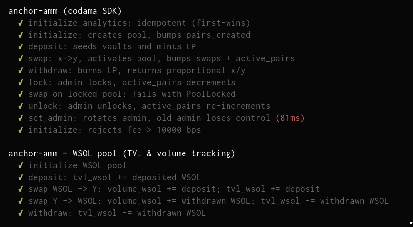

# anchor amm



classwork for turbin3 q2 2026, constant-product amm with WSOL-side analytics tracking.

## updates

- added singleton `Analytics` account (admin-gated lock/unlock, tracks tvl/volume/swaps/pairs)
- fee bounds check, `Config.locked` guard on swap/deposit/withdraw
- removed per-pool authority — single global admin via `Analytics.admin`
- `set_admin` instruction for admin rotation
- `lock` / `unlock` instructions, gated by `Analytics.admin`
- helper script to bootstrap the singleton analytics PDA

## project layout

```
anchor-amm/
├── app/                                 # front-end glue (see ../frontend)
├── Anchor.toml                          # anchor workspace config
├── Cargo.toml                           # rust workspace
├── rust-toolchain.toml
├── codama.mjs                           # writes only to sdk/src/generated/
├── package.json                         # root: dev scripts (sdk:gen, sdk:regen, init:analytics)
├── tsconfig.json                        # ts-mocha config for tests
├── migrations/
│   └── deploy.ts                        # anchor deploy hook
├── scripts/
│   ├── deploy-devnet.sh                 # build + deploy + idl upgrade + sdk regen
│   └── initialize-analytics.ts          # one-shot bootstrap of singleton Analytics PDA
├── programs/
│   └── anchor-amm/
│       ├── Cargo.toml
│       ├── src/
│       │   ├── lib.rs                   # #[program] entrypoints
│       │   ├── constants.rs             # WSOL_MINT, ANALYTICS_SEED
│       │   ├── error.rs
│       │   ├── state.rs                 # Config (per pool) + Analytics (singleton)
│       │   ├── instructions.rs          # module re-exports
│       │   └── instructions/
│       │       ├── initialize_analytics.rs  # one-time singleton init (first-wins)
│       │       ├── initialize.rs            # create pool config + vaults + lp mint
│       │       ├── deposit.rs               # add liquidity, mint lp
│       │       ├── withdraw.rs              # burn lp, redeem reserves
│       │       ├── swap.rs                  # constant-product swap, fee net via curve
│       │       ├── lock.rs                  # admin: pause a pool
│       │       ├── unlock.rs                # admin: resume a pool
│       │       └── set_admin.rs             # admin: rotate Analytics.admin
│       └── tests/
│           └── anchor-amm.ts            # mocha tests (codama SDK + WSOL pool block)
└── sdk/                                 # ← publishable package root
    ├── package.json                     # @trib3/anchor-amm-sdk
    ├── tsconfig.json
    ├── tsup.config.ts
    ├── src/
    │   ├── index.ts                     # re-export generated
    │   └── generated/                   # codama-overwritten only
    └── dist/                            # build output (esm + cjs + dts)
```

## instructions

| ix | who | what |
|----|-----|------|
| `initialize_analytics(admin)` | anyone (first-wins) | bootstrap singleton Analytics PDA, set admin + `created_at` |
| `initialize(seed, fee)` | anyone | create pool: Config, vault X/Y, LP mint; `pairs_created += 1` |
| `deposit(amount, max_x, max_y)` | LP | seed/add liquidity, mint LP; WSOL side → `tvl_wsol += deposit` |
| `withdraw(amount, min_x, min_y)` | LP | burn LP, redeem proportional reserves; WSOL side → `tvl_wsol -= withdraw` |
| `swap(is_x, amount_in, min_amount_out)` | trader | constant-product swap, fee charged inside curve, residue stays for LPs; `swaps += 1`; first swap activates pool & `active_pairs += 1`; WSOL leg → `volume_wsol += flow`, `tvl_wsol ± delta` |
| `lock` | `Analytics.admin` | pause swap/deposit/withdraw on a pool; if activated → `active_pairs -= 1` |
| `unlock` | `Analytics.admin` | resume; if activated → `active_pairs += 1` |
| `set_admin(new_admin)` | `Analytics.admin` | rotate global admin |

## fee model

Curve crate (`constant-product-curve`) applies `(10_000 - fee) / 10_000` to `amount_in` before AMM math. Fee residue stays in the pool — implicit LP yield (Uniswap V2 style). No protocol-fee skim.

## analytics caveats

- **`tvl_wsol` / `volume_wsol` track only the WSOL side** of any pool that contains WSOL. Non-WSOL pools contribute nothing. No oracle → no cross-asset TVL.
- **`active_pairs` = pools with ≥1 swap and not currently locked.** Init-only-never-used pools don't count.

## bootstrap (devnet)

```bash
pnpm run deploy:devnet         # build + deploy + idl upgrade + sdk regen
pnpm run init:analytics        # initialize singleton (sets caller as admin)
```

Env for the init script: `ANCHOR_WALLET`, `RPC_URL` (default localnet). Flag: `--admin <pubkey>`.
