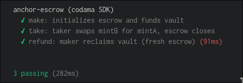

# anchor escrow



classwork for turbin3 q2 2026, tinkering around codama.

## updates

- now supports partial take

## project layout

```
anchor-escrow/
├── app/                                 # front-end, coming soon
├── Anchor.toml                          # anchor workspace config
├── Cargo.toml                           # rust workspace
├── rust-toolchain.toml
├── codama.mjs                           # writes only to sdk/src/generated/
├── package.json                         # root: dev scripts (sdk:gen, sdk:regen)
├── tsconfig.json                        # ts-mocha config for tests
├── migrations/
│   └── deploy.ts                        # anchor deploy hook
├── programs/
│   └── anchor-escrow/
│       ├── Cargo.toml
│       ├── src/
│       │   ├── lib.rs                   # #[program] entrypoints (make/take/refund)
│       │   ├── constants.rs
│       │   ├── error.rs
│       │   ├── state.rs                 # Escrow account
│       │   ├── instructions.rs          # module re-exports
│       │   └── instructions/
│       │       ├── make.rs              # init escrow + fund vault
│       │       ├── take.rs              # swap mintB → mintA, close escrow
│       │       └── refund.rs            # maker reclaims vault
│       └── tests/
│           └── anchor-escrow.ts         # mocha tests driven by codama SDK
└── sdk/                                 # ← publishable package root
    ├── package.json                     # @trib3/anchor-escrow-sdk
    ├── tsconfig.json
    ├── tsup.config.ts
    ├── src/
    │   ├── index.ts                     # re-export generated
    │   └── generated/                   # codama-overwritten only
    └── dist/                            # build output (esm + cjs + dts)
```

