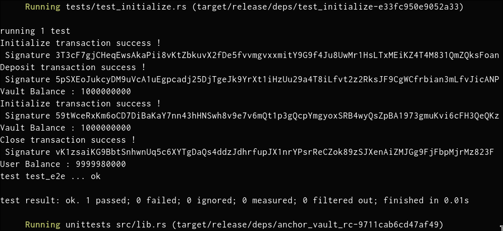

# anchor vault — stored vs recomputed PDA bump

classwork for turbin3 q2 2026, tinkering around bumps, CU vs rents.



two programs, same instructions, different bump strategy:

- `anchor-vault` (Variant B): stores `state_bump` + `vault_bump` in `VaultState`. Anchor uses `create_program_address` with stored byte.
- `anchor-vault-rc` (Variant A): empty `VaultState`. Anchor recomputes via `find_program_address` each ix; signer seeds use `ctx.bumps.vault`.

Bench at [programs/anchor-vault/tests/bench_bumps.rs](programs/anchor-vault/tests/bench_bumps.rs). LiteSVM, 64 random users, full lifecycle on both programs. CU from `TransactionMetadata.compute_units_consumed`. Rent from `solana_rent::Rent::default()`.

## Results (mean CU, n=64)

| ix | CU recompute | CU stored | CU saved |
|----|----|----|----|
| initialize | 11179 | 11081 | ~0 (noise) |
| deposit    | 9484  | 6550  | **2934** |
| withdraw   | 9573  | 6627  | **2946** |
| close      | 10368 | 7423  | **2945** |

Variant B deposit/withdraw/close CU is constant — stored bump skips the find loop.
Variant A varies with bump value (each fail iter ≈ 1500 CU). Sampled bumps 248–255 here; worst case (bump=0) ≈ 255 × 1500 ≈ 380k CU.

## Rent

| `VaultState` size | bytes | rent (lamports) |
|----|----|----|
| no bumps stored | 8  | 946,560 |
| 2 bumps stored  | 10 | 960,480 |
| **extra**       | **+2** | **+13,920** |

## Break-even

```
break_even_calls = extra_rent / (CU_saved * lamports_per_CU)
```

| lamports/CU | break-even calls (deposit/withdraw/close) |
|----|----|
| 0   | never (no CU lamport cost) |
| 1   | **5** |
| 100 | 1 |
| 10k | 1 |

## Conclusions

- Storing 2 bumps amortizes after **~5 ix calls** at priority fee ≥ 1 lamport/CU.
- Initialize alone gains nothing — write cost ≈ find cost.
- Rent is recoverable on close, so stored bump is effectively free post-recovery.
- Stored bump also caps worst-case CU; recompute exposes long tail when bump ≪ 255.

## Run

```sh
cargo build-sbf
cargo test --test bench_bumps --release -- --nocapture
```
